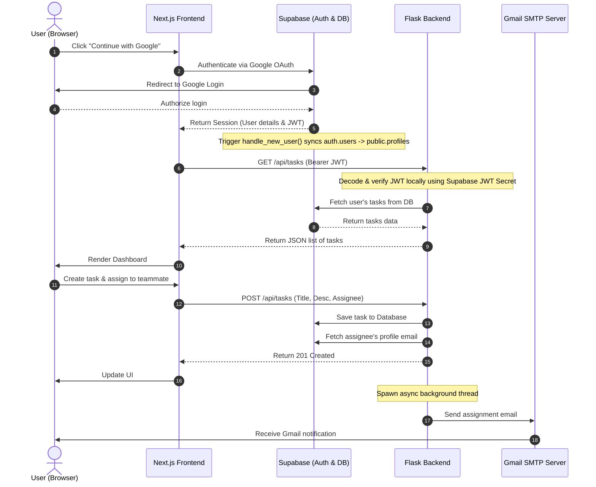

# TaskHub - Task Management & Assignment Web Application

TaskHub is a simple, premium web application built for seamless team task management. Users can sign in with their Google/Gmail accounts, create tasks, assign them to team members, and receive automatic email notifications via Gmail SMTP when tasks are created or completed.

---

## 🏗️ Architecture & System Design

TaskHub follows a modern decoupled full-stack architecture:



### 1. Frontend (Next.js + TypeScript + Tailwind CSS)
- **Framework**: Next.js (App Router) with static optimization and TypeScript for type safety.
- **Styling**: Tailwind CSS with a clean glassmorphic dark-mode design system.
- **Authentication**: Integrates `@supabase/supabase-js` to perform client-side Google OAuth.
- **API Communication**: Queries the Flask API, passing the Supabase access token (JWT) in the `Authorization: Bearer <token>` header of every request.

### 2. Backend (Flask)
- **Framework**: Python Flask API server.
- **Security & Authorization**: Custom decorator (`@require_auth`) decodes and verifies the incoming Supabase JWT locally using the project's `SUPABASE_JWT_SECRET`. This prevents unnecessary roundtrips to Supabase Auth servers.
- **Database Interaction**: Uses the Supabase Python SDK to interact with the database.
- **Notification Engine**: Integrates Gmail SMTP over SSL (`smtplib`) inside background threads (`threading.Thread`) to keep responses extremely fast.

### 3. Database (Supabase PostgreSQL)
- **Profiles Table**: Stores public user details (`id` matching `auth.users`, `email`, `full_name`, `avatar_url`).
- **Tasks Table**: Stores task records with title, description, status, and foreign keys references to user profiles.
- **Database Trigger**: An automated PL/pgSQL function and trigger (`on_auth_user_created`) inserts a row into `public.profiles` as soon as a user successfully signs in with Google OAuth for the first time.
- **Indexes**: Query performance is optimized using database indexes on search-heavy columns like `created_by` and `assigned_to`.

---

## 🗄️ Database Schema & Migrations

Database setup files are located in the [/migrations](file:///c:/Users/DELL/OneDrive/Desktop/TaskHub/migrations) folder:
- **[0001_init_schema.sql](file:///c:/Users/DELL/OneDrive/Desktop/TaskHub/migrations/0001_init_schema.sql)**: Contains the SQL definition for tables (`profiles`, `tasks`), indexes, security definer triggers, and triggers matching standard Supabase integration design.

---

## ⚙️ Configuration & Environment Variables

Make sure to configure both frontend and backend before running locally.

### Backend Configurations (`/backend/.env`)
See [backend/.env.example](file:///c:/Users/DELL/OneDrive/Desktop/TaskHub/backend/.env.example):
```ini
FLASK_PORT=5000
FLASK_DEBUG=True
SUPABASE_URL=https://your-project.supabase.co
SUPABASE_KEY=your-supabase-service-role-key-or-anon-key
SUPABASE_JWT_SECRET=your-supabase-jwt-secret-from-dashboard
GMAIL_EMAIL=your-email@gmail.com
GMAIL_APP_PASSWORD=your-gmail-app-password
```

### Frontend Configurations (`/frontend/.env`)
See [frontend/.env.example](file:///c:/Users/DELL/OneDrive/Desktop/TaskHub/frontend/.env.example):
```ini
NEXT_PUBLIC_SUPABASE_URL=https://your-project.supabase.co
NEXT_PUBLIC_SUPABASE_ANON_KEY=your-supabase-anon-key
NEXT_PUBLIC_API_URL=http://localhost:5000
```

---

## 🚀 Local Quickstart

### Prerequisites
- Node.js (v18+)
- Python (v3.10+)

### Step 1: Set up Supabase
1. Create a new Supabase Project.
2. In the Supabase Dashboard, navigate to the **SQL Editor** and run the contents of [0001_init_schema.sql](file:///c:/Users/DELL/OneDrive/Desktop/TaskHub/migrations/0001_init_schema.sql).
3. Set up Google OAuth in Supabase under **Authentication > Providers > Google** (specify client id and secret from Google Cloud Console).
4. Configure redirect URL in Supabase dashboard to: `http://localhost:3000/dashboard` (for local dev) or your deployed frontend domain (for production).

### Step 2: Start Flask Backend
From the root directory:
```bash
cd backend
# Create python virtual environment
python -m venv venv
# Activate virtual environment
# Windows:
venv\Scripts\activate
# Install dependencies
pip install -r requirements.txt
# Copy environment file and fill details
copy .env.example .env
# Run Flask app
python app.py
```

### Step 3: Start Next.js Frontend
Open a new terminal session:
```bash
cd frontend
# Install packages
npm install
# Copy environment file and fill details
copy .env.example .env.local
# Start dev server
npm run dev
```
Open [http://localhost:3000](http://localhost:3000) in your browser.

---

## 🌐 Production Deployment Guide

To deploy the application to production:

### 1. Database (Supabase)
- Database schema is persistent on Supabase.
- Add your production frontend domain (e.g. `https://your-app.vercel.app/dashboard`) to the **Additional Redirect URLs** in your Supabase Auth settings.

### 2. Backend (Render / Railway)
- Deploy the `/backend` folder to a hosting provider like Render or Railway.
- Configure the environment variables in the host dashboard.
- Ensure the start command is configured to: `gunicorn app:app` (include `gunicorn` in `requirements.txt`).

### 3. Frontend (Vercel)
- Import your repository in Vercel.
- Select the `frontend` folder as the Root Directory.
- Set the environment variables in the Vercel dashboard.
- Vercel will automatically build and deploy the Next.js app.
